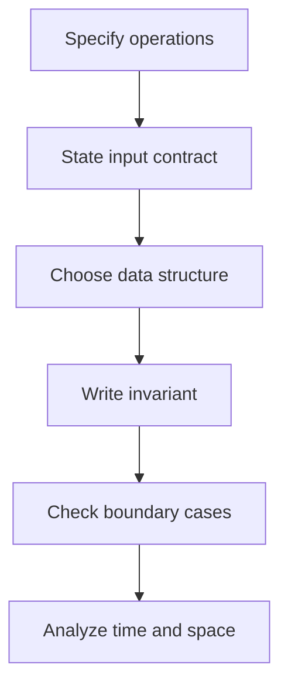

## Notebook map

This **Demo** illustrates how a programming course can be organized in a readable archive. Sample progress and semester metadata are placeholders.

## Choose a structure by operations

| Structure | Random access | Search | Insert/delete |
| --- | --- | --- | --- |
| Dynamic array | $O(1)$ | $O(n)$ unsorted | $O(n)$ at an arbitrary position; amortized $O(1)$ append |
| Singly linked list | $O(n)$ | $O(n)$ | $O(1)$ after a known predecessor |
| Balanced search tree | $O(\log n)$ lookup by key | $O(\log n)$ | $O(\log n)$ |
| Hash table | Not an index-based sequence | Expected $O(1)$ key lookup | Expected $O(1)$; implementation assumptions matter |

不要省略操作的前提。链表的“插入 $O(1)$”通常假设插入位置已经找到；散列表的平均复杂度依赖散列函数和负载管理。

## Binary search as an invariant

For an ascending sequence, `lower_bound(a, x)` returns the first index whose value is at least `x`, or `len(a)` if none exists. It uses the half-open interval `[lo, hi)`.

```python
def lower_bound(a, x):
    lo, hi = 0, len(a)
    while lo < hi:
        mid = lo + (hi - lo) // 2
        if a[mid] < x:
            lo = mid + 1
        else:
            hi = mid
    return lo

assert lower_bound([], 4) == 0
assert lower_bound([1, 2, 2, 5], 2) == 1
assert lower_bound([1, 2, 2, 5], 9) == 4
```

### Why it terminates and is correct

The invariant is that every index before `lo` contains a value below `x`, while every index at or after `hi` contains a value at least `x`. Each iteration shrinks the candidate interval. When `lo == hi`, that index is the boundary required by the contract.

The loop takes $O(\log(n+1))$ comparisons and $O(1)$ extra space. If random access is expensive, the same comparison count does not imply the same running time.

## Workflow diagram



## Exercises

1. Modify `lower_bound` to return the first index strictly greater than `x`.
2. Explain why replacing `hi = mid` with `hi = mid - 1` changes the interval convention.
3. Compare inserting one thousand elements at the front of an array with inserting them after a known linked-list head.

## Homework and files

TODO: import actual course folders, lecture files, and homework notes. Imported Markdown gets a reader page while the original folder hierarchy and download files are retained.
