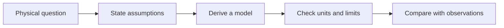

import Callout from '../../../components/Callout.astro';

## Notebook map

This **Demo** illustrates a course archive; the semester and progress bar are sample metadata, not a verified enrollment or completed course record. Topics can be expanded into separate lecture files after a folder import.

| Topic | Main question | Model assumption |
| --- | --- | --- |
| Debye shielding | How far does an electrostatic disturbance reach? | Near equilibrium, weak potential |
| Plasma oscillation | What is the electron response time? | Cold electrons, fixed ions |
| Magnetized motion | How does the field alter trajectories? | Uniform prescribed magnetic field |

## Debye shielding

取固定、均匀的离子背景 $n_i=n_0$；电子处于温度 $T_e$ 的热平衡。电子的电荷为 $-e$，因此静电势 $\phi$ 中的 Boltzmann 分布为

$$
n_e=n_0\exp\left(\frac{e\phi}{k_BT_e}\right).
$$

Away from an externally imposed source charge, Poisson's equation becomes

$$
\nabla^2\phi=-\frac{e(n_i-n_e)}{\epsilon_0}
\simeq\frac{n_0e^2}{\epsilon_0k_BT_e}\phi
=\frac{\phi}{\lambda_{De}^2},
\qquad \lambda_{De}=\sqrt{\frac{\epsilon_0k_BT_e}{n_0e^2}}.
$$

The linearization requires $|e\phi|\ll k_BT_e$. In one dimension, a decaying solution varies as $e^{-|x|/\lambda_{De}}$ away from a localized source; boundary and source conditions determine the amplitude.

<Callout title="Units and temperature conventions">
Here $T_e$ is in kelvin, so the thermal energy is $k_BT_e$. If a temperature is quoted as an energy in electronvolts, convert that energy to joules and use it in place of $k_BT_e$.
</Callout>

### Physical interpretation

电子趋向于聚集在正电势区域，逐渐抵消外加电荷的电场。Debye length describes an equilibrium shielding scale; it is not automatically the scale of every time-dependent plasma disturbance.

## Collective response

The electron plasma frequency is

$$
\omega_{pe}=\sqrt{\frac{n_0e^2}{\epsilon_0m_e}}.
$$

A weakly coupled plasma usually has many particles in a Debye sphere, $N_D=(4\pi/3)n_0\lambda_{De}^3\gg1$. A collisionless description also needs a response time short compared with the relevant collision time, for example $\omega_{pe}\tau\gg1$. State the physical context before treating these estimates as universal definitions.

## Charged-particle motion

For a uniform magnetic field with no electric field,

$$
m\frac{d\mathbf{v}}{dt}=q\mathbf{v}\times\mathbf{B},
\qquad |\Omega_c|=\frac{|q|B}{m},\qquad r_L=\frac{v_\perp}{|\Omega_c|}.
$$

The magnetic force does no work because $\mathbf{v}\cdot(\mathbf{v}\times\mathbf{B})=0$. The sense of gyration depends on the sign of $q$ and on the viewing direction; do not infer it from the unsigned frequency alone.

## Questions for review

1. Which assumption fails when $|e\phi|$ approaches $k_BT_e$?
2. Why can a magnetic field bend a trajectory without changing kinetic energy?
3. Which two separate tests are needed before assuming a collisionless, collective response?

## Homework and cheat sheets

TODO: add actual lecture notes, homework reasoning, and an instructor-approved formula sheet. The PDF below only demonstrates opening and downloading an attachment.

## A model-building workflow

This conceptual flow illustrates Mermaid support. Each physical model requires its own assumptions and validation.

