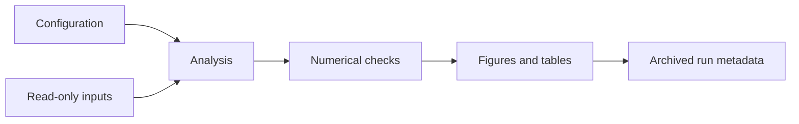

## Project overview

This **Demo** presents a maintainable workflow template. It does not represent a completed research project or claim a public code release.

## Directory contract

```text
experiment/
├── README.md             # question, assumptions, reproduction steps
├── config.yaml           # units, parameters, seeds, input references
├── src/                  # analysis code
├── tests/                # meaningful numerical and unit checks
├── data-links.yaml       # source URLs and checksums; no large raw data
└── outputs/
    ├── figures/          # derived plots with captions
    └── run-metadata.json # code version and runtime information
```

## Workflow



## Reproduction record

Record the code commit, input checksums, environment versions, configuration, random seed, and output paths. A random seed is only one part of reproducibility: library behavior and hardware-dependent parallel reductions may still change results.

## Verification plan

For a numerical analysis, prefer an analytic limiting case, a unit check, and a convergence study. For an image pipeline, preserve the raw frames and check the shift sign using synthetic input. These checks answer scientific questions beyond whether a function executes.

## Planned outputs

TODO: replace this page with an actual repository, screenshots, instructions, and known limitations. Store large datasets in an appropriate external archive and keep their metadata here.
